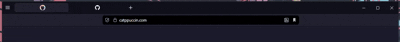

# Vivaldi Auto-Hide Bookmark Bar

A sleek CSS modification for Vivaldi browser that creates an auto-hiding bookmark bar with smooth animations, hover effects, and custom about:blank styling.

## ✨ Features

- **Auto-hide functionality**: Bookmark bar stays hidden until you need it
- **Smooth animations**: Elegant slide-in/out transitions with customizable timing
- **Smart hover detection**: Shows on header, tab strip, or bookmark bar hover
- **Delayed hiding**: 1-second delay before hiding to prevent accidental disappearance
- **Clean tab design**: Centered favicons with hidden close buttons and titles
- **High z-index**: Ensures bookmark bar appears above all other UI elements
- **Custom about:blank styling**: Dark background for blank pages using `#11111b` color

## 🎥 Demo


<div align="center">
  
</div>

The bookmark bar will:
1. Stay hidden by default for a clean browsing experience
2. Smoothly slide down when you hover over the browser header or tabs
3. Remain visible while you're interacting with it
4. Hide automatically after 1 second when you stop hovering

## 📦 Installation

1. **Enable CSS modifications in Vivaldi**:
   - Go to `vivaldi://experiments/`
   - Enable "Allow for using CSS modifications"
   - Restart Vivaldi

2. **Locate your Vivaldi profile folder**:
   - **Windows**: `%LOCALAPPDATA%\Vivaldi\User Data\Default`
   - **macOS**: `~/Library/Application Support/Vivaldi/Default`
   - **Linux**: `~/.config/vivaldi/Default`

3. **Create the custom CSS file**:
   - Create a file named `vivaldi.css` in your profile folder
   - Copy the CSS code from this repository into the file
   - Save and restart Vivaldi

## 🎨 Customization

You can easily customize the behavior by modifying the CSS variables at the top of the file:

```css
:root {
  --vivaldi-bookmark-bar-height: 30px;     /* Height of the bookmark bar */
  --vivaldi-header-height: 34px;           /* Adjust based on your UI */
  --bookmark-bar-hide-delay: 1s;           /* Delay before hiding (in seconds) */
  --bookmark-bar-animation-duration: 0.2s; /* Animation speed */
  --bookmark-bar-shadow: 0 2px 5px rgba(0, 0, 0, 0.15); /* Drop shadow */
  --bookmark-bar-z-index: 10000;           /* Stacking order */
  --about-blank-bg-color: #11111b;         /* Background color for about:blank pages */
}
```

### Popular Customizations

**Faster animations**:
```css
--bookmark-bar-animation-duration: 0.1s;
```

**Longer delay before hiding**:
```css
--bookmark-bar-hide-delay: 5s;
```

**No shadow**:
```css
--bookmark-bar-shadow: none;
```

**Different about:blank background color**:
```css
--about-blank-bg-color: #000000; /* Pure black */
--about-blank-bg-color: #1e1e2e; /* Catppuccin Mocha base */
--about-blank-bg-color: #282a36; /* Dracula background */
```

## 🔧 Troubleshooting

### Bookmark bar appears behind other elements
- Increase the z-index value:
  ```css
  --bookmark-bar-z-index: 99999;
  ```

### Delay not working properly
- Make sure you're using the latest version of the CSS
- Try disabling other Vivaldi modifications temporarily

### Animation feels choppy
- Reduce the animation duration:
  ```css
  --bookmark-bar-animation-duration: 0.1s;
  ```

### Bookmark bar height issues
- Adjust the height variable to match your bookmark bar:
  ```css
  --vivaldi-bookmark-bar-height: 35px;
  ```

### About:blank styling not working
- Ensure you've restarted Vivaldi after applying the CSS changes
- Try clearing browser cache if the styling doesn't apply immediately

## 📝 Changelog

### v1.1.0 (2025-05-30)
**Added:**
- Custom about:blank page styling with dark background (`#11111b`)
- CSS variable for customizable about:blank background color
- Multiple selector approaches for better about:blank targeting
- White text color for better contrast on dark background

**Changed:**
- Updated README with new customization options
- Added troubleshooting section for about:blank styling

### v1.0.0 (Initial Release)
**Added:**
- Auto-hide bookmark bar functionality
- Smooth animations with customizable timing
- Smart hover detection
- Clean tab design with centered favicons
- Comprehensive CSS variable system for easy customization

## 🤝 Contributing

Found a bug or have a suggestion? Feel free to:
- Open an issue
- Submit a pull request
- Share your customizations

## 📝 License

This project is licensed under the MIT License - feel free to use and modify as needed.

## 🙏 Acknowledgments

- Thanks to the Vivaldi community for inspiration and testing
- Built for Vivaldi browser users who love clean, minimal interfaces

---

**Note**: This modification requires Vivaldi's experimental CSS feature to be enabled. Use at your own discretion and always backup your profile before making modifications.